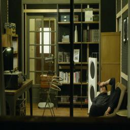
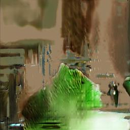
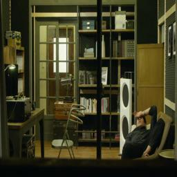
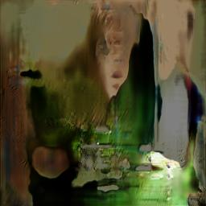
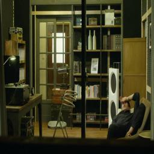
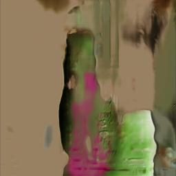
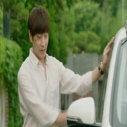
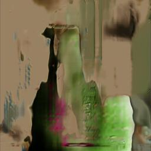
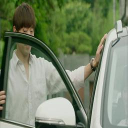
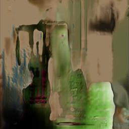

# DramaGAN
Long Image Sequence Generation from Text

## Usage
1. Download Dataset
  - Download Structure
  ```
	-- dataset
	    |- Drama_Dataset
			|- AnotherMissOh_QA
			|- AnotherMissOh_images
			|- AnotherMissOh_subtitles.json 
  ```
2. Set Config.py train_settings
  - "load_pretrained" should be None if training from beginning. If not, set {"epoch", "iteration"}, both zero-indexed. If pretrained does not exist, will train from beginning.

3. Train
```bash
python train.py
```

## StoryGAN Result
| Real Images | Generated Images |
:-------------------------:|:-------------------------:
 |  
 |  
 |  
 |  
 |  

